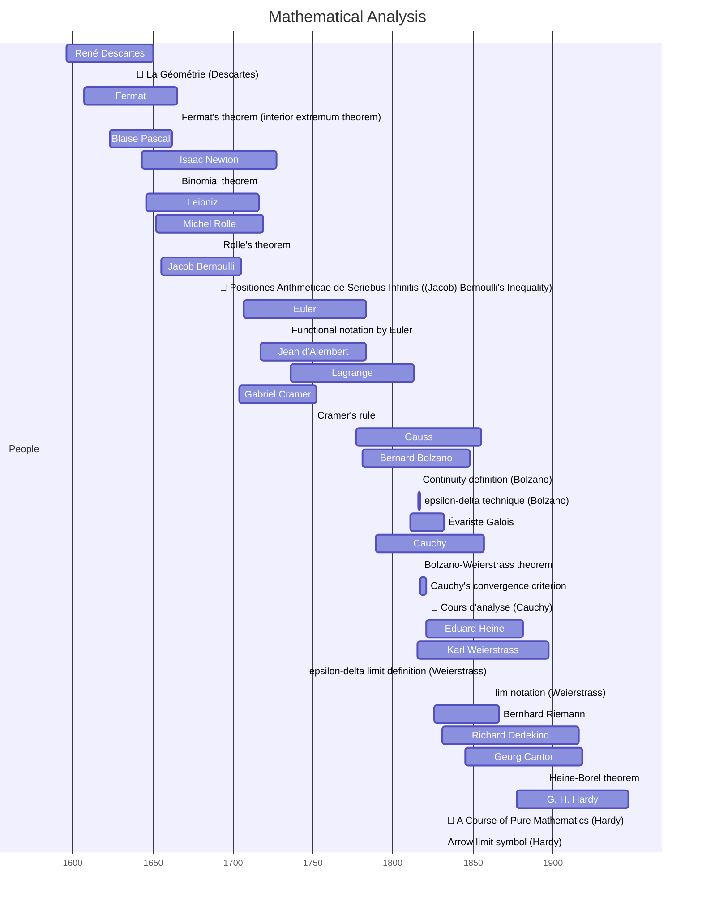

```mermaid

gantt
    title Mathematical Analysis
    dateFormat YYYY
    axisFormat %Y
    section People 
        René Descartes: 1596, 1650
        📕 La Géométrie (Descartes): 1637
        Fermat: 1607, 1665  
        Fermat's theorem (interior extremum theorem): 
        Blaise Pascal: 1623, 1662
        Isaac Newton: 1643, 1727
        Binomial theorem: 1665
        Leibniz: 1646, 1716
        Michel Rolle: 1652, 1719
        Rolle's theorem: 1691
        Jacob Bernoulli: 1655, 1705
        📕 Positiones Arithmeticae de Seriebus Infinitis ((Jacob) Bernoulli's Inequality): 1689 
        Euler: 1707, 1783
        Functional notation by Euler: 1734
        Jean d’Alembert: 1717, 1783
        Lagrange: 1736, 1813
        Gabriel Cramer: 1704, 1752 
        Cramer's rule: 1750
        Gauss: 1777, 1855
        Bernard Bolzano: 1781, 1848
        Continuity definition (Bolzano) : 1816 
        epsilon-delta technique (Bolzano) : 1817
        Évariste Galois: 1811, 1832
        Cauchy :1789, 1857
        Bolzano-Weierstrass theorem: 1817
        Cauchy's convergence criterion: 1821
        📕 Cours d'analyse (Cauchy): 1821
        Eduard Heine: 1821, 1881
        Karl Weierstrass: 1815, 1897
        epsilon-delta limit definition (Weierstrass) : 1861, 1861
        lim notation (Weierstrass) : 1861, 1861
        Bernhard Riemann: 1826, 1866
        Richard Dedekind: 1831, 1916
        Georg Cantor :1845, 1918
        Heine-Borel theorem: 1895   
        G. H. Hardy: 1877, 1947
        📕 A Course of Pure Mathematics (Hardy): 1908  
        Arrow limit symbol (Hardy): 1908

```

