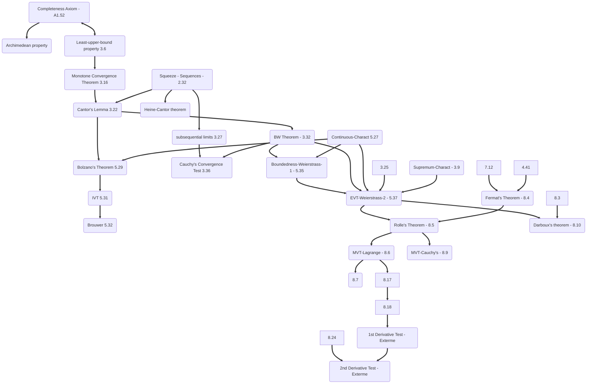

### textbook

- BW theorem (3.32)
- Fermat's Theorem (8.4)
- (5.37 & 8.4) => Rolle's Theorem (8.5)
- MVT-Lagrange (8.6)
- MVT-Cauchy's (8.9)
- Darboux's theorem (8.10)
- Supremum-Charact (3.9)
- (5.35 & 3.32 & 3.25 & 5.27 & 3.9) => EVT-Weierstrass-2 (5.37)
- IVT (5.31)

